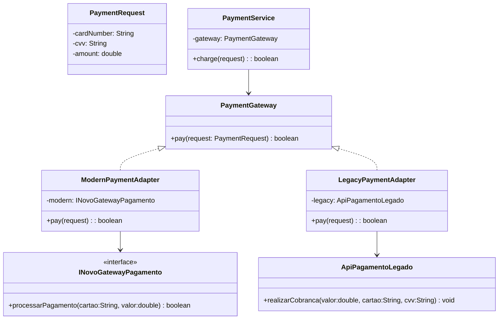
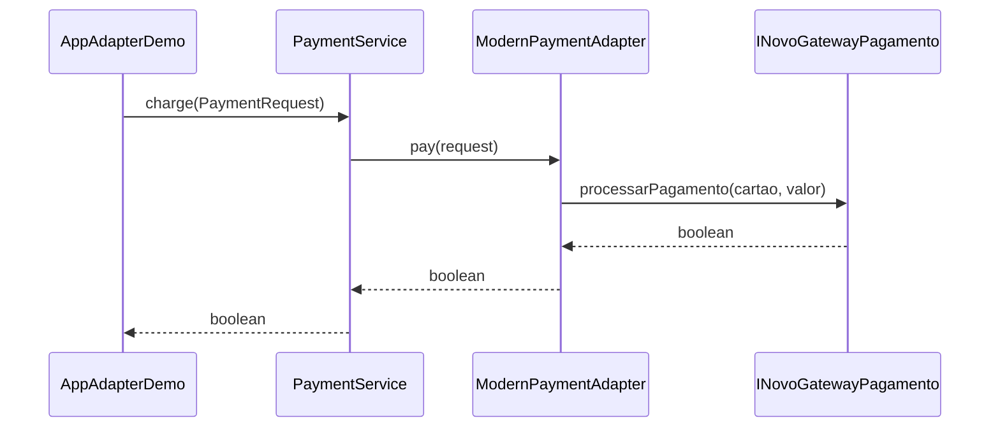

# Padrão de Projeto: Adapter

## 📌 Problema Original (GoHorse)
Dois gateways de pagamento com **APIs incompatíveis**:
- Moderno: `processarPagamento(cartao, valor)` → `boolean`
- Legado: `realizarCobranca(valor, cartao, cvv)` → `void`

O serviço antigo usava flag `usarLegado` + `if/else`, violando **SRP/OCP/DIP** e criando alto acoplamento.

---

## 🎯 Objetivo
Oferecer **uma única interface-alvo** para pagamento, eliminando `ifs` e diferenças de assinatura.

---

## 🧱 Solução (Object Adapter)
- **Target**: `PaymentGateway#pay(PaymentRequest)`
- **Adapters**: `ModernPaymentAdapter`, `LegacyPaymentAdapter`
- **Adaptees**: `GatewayPagamentoModerno`, `ApiPagamentoLegado`
- **Client/Service**: `PaymentService` (depende só de `PaymentGateway`)

---

## 🧬 Mini UML (Mermaid)

### Class Diagram


### Sequence (fluxo moderno)


---

## 📂 Estrutura
```
src/main/java/designpattern/
 ├── api/PaymentGateway.java
 ├── model/PaymentRequest.java
 ├── adapters/{LegacyPaymentAdapter,ModernPaymentAdapter}.java
 ├── service/PaymentService.java
 └── AppAdapterDemo.java
```

## ⚙️ Execução
```bash
mvn -q -DskipTests package
java -cp target/classes designpattern.AppAdapterDemo
```

### ✅ Benefícios
DIP/OCP, SRP, nenhum `if/flag`, novo gateway = **novo adapter**.

🧩 Adapter — Antes e Depois

Antes:
O código de pagamento era uma bagunça.
O sistema tinha dois jeitos diferentes de fazer pagamento — um moderno e um antigo.
Pra funcionar, o programa fazia assim:

“Se for o moderno, chama esse método; se for o antigo, chama aquele outro.”

Ou seja, um monte de if e boolean usarLegado espalhados.
Toda vez que aparecia um novo tipo de pagamento, tinha que abrir o código e mexer lá dentro.

Depois:
Agora existe uma interface única chamada PaymentGateway, como se fosse uma porta de entrada padrão.
Cada sistema de pagamento ganhou seu “adaptador”, que traduz o jeito dele para essa porta.
O serviço de pagamento só fala com essa interface — ele não quer saber quem está por trás.

👉 Resultado:
O código ficou mais simples, sem if pra escolher gateway.
Se amanhã surgir um novo tipo de pagamento, é só criar um novo adaptador — sem mexer no resto do sistema.
