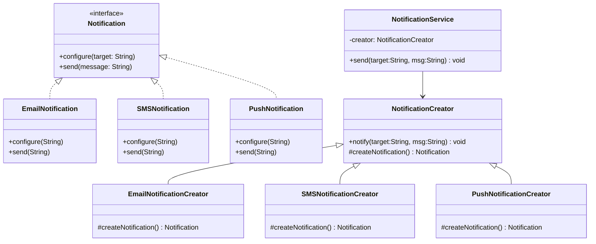
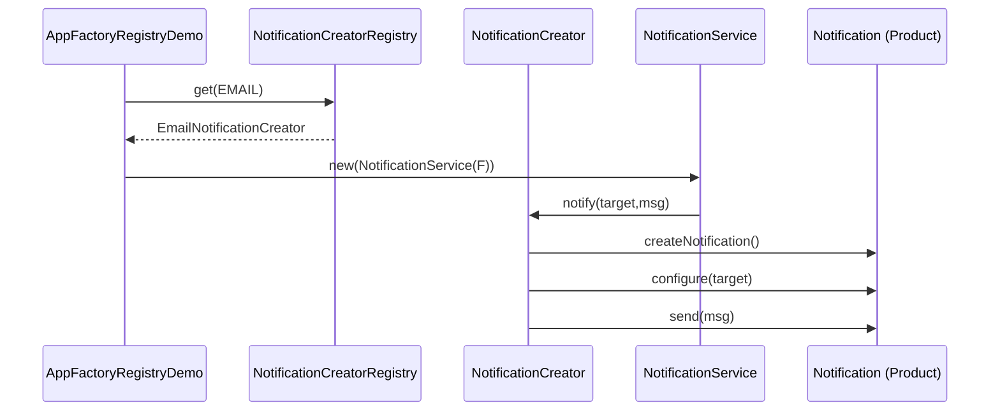

# Padrão de Projeto: Factory Method

## 📌 Problema Original (GoHorse)
Criação com `switch("EMAIL"|"SMS"|"PUSH")` dentro do serviço:
- **Acoplamento** a concretos
- **Baixa extensibilidade** (cada novo canal altera o switch)
- Viola **SRP/OCP/DIP**

---

## 🎯 Objetivo
Encapsular a **criação** de notificações, padronizar o fluxo `configurar + enviar` e remover `switch/new` do alto nível.

---

## 🧱 Solução (Factory Method)
- **Product**: `Notification` (interface)
- **Concrete Products**: `EmailNotification`, `SMSNotification`, `PushNotification`, *(ex.: WhatsApp)*  
- **Creator**: `NotificationCreator#notify(...)` + `createNotification()`
- **Concrete Creators**: `EmailNotificationCreator`, `SMS...`, `Push...`, *(WhatsApp...)*
- **Service**: `NotificationService` (depende do **Creator**)
- **Registry (opcional)**: `NotificationType` + `NotificationCreatorRegistry`

---

## 🧬 Mini UML (Mermaid)

### Class Diagram


### Sequence (via Registry)


---

## 📂 Estrutura
```
src/main/java/designpattern/
 ├── api/Notification.java
 ├── product/{EmailNotification,SMSNotification,PushNotification,WhatsAppNotification}.java
 ├── factory/{NotificationCreator,Email...,SMS...,Push...,WhatsApp...Creator}.java
 ├── factory/{NotificationType,NotificationCreatorRegistry}.java
 ├── service/NotificationService.java
 ├── AppFactoryMethodDemo.java
 └── AppFactoryRegistryDemo.java
```

## ⚙️ Execução
```bash
mvn -q -DskipTests package
java -cp target/classes designpattern.AppFactoryMethodDemo
java -cp target/classes designpattern.AppFactoryRegistryDemo
```

### ✅ Benefícios
**SRP** (criar ≠ enviar), **OCP** (novo canal = novo Product + Creator), **DIP** (serviço depende do Creator), sem `switch/new`.

🏭 Factory Method — Antes e Depois

Antes:
O sistema que mandava mensagens (notificações) tinha um grande switch:

“Se o tipo for EMAIL, cria esse objeto.
Se for SMS, cria aquele.
Se for PUSH, cria outro.”

Ou seja: toda vez que surgia um novo tipo de mensagem, o programador precisava abrir o código, colocar mais um case e compilar tudo de novo.

Depois:
Agora existe uma fábrica de notificações.
Essa fábrica é quem decide qual tipo criar, e cada tipo de mensagem (e-mail, SMS, push, WhatsApp) tem sua própria mini-fábrica.

O sistema principal só pede:

“Ei, fábrica, envie essa mensagem!”
E a fábrica se vira para criar o objeto certo.

👉 Resultado:
O código não precisa mais de switch nem de new espalhado.
Se quiser adicionar WhatsApp, basta criar uma nova classe e registrar na fábrica — sem tocar no resto.