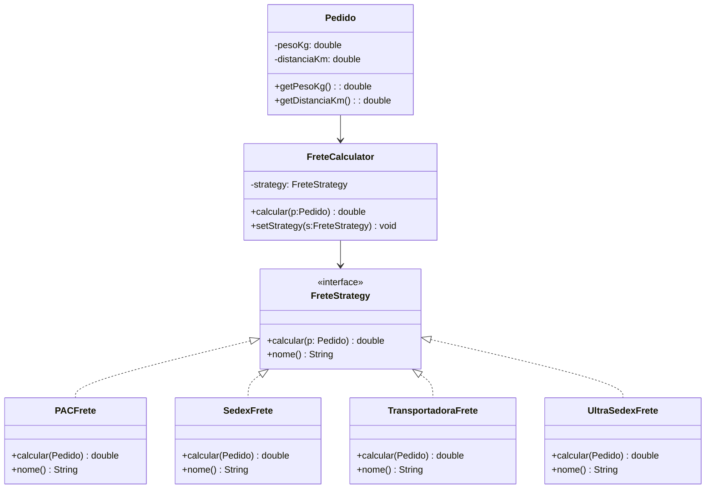
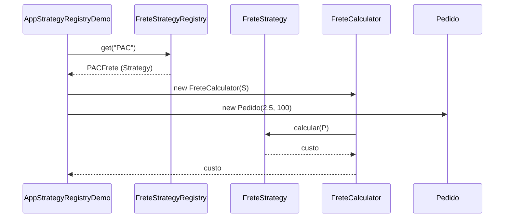

# Padrão de Projeto: Strategy

## 📌 Problema Original (GoHorse)
`Pedido.calcularFrete(String metodo)` com `switch` para PAC/SEDEX/TRANSPORTADORA:
- Mistura **dados + regra**
- Dificuldade de extensão
- Viola **SRP**, **OCP** e **DIP**

---

## 🎯 Objetivo
Extrair **algoritmos de frete** em estratégias independentes, selecionáveis em runtime.

---

## 🧱 Solução (Strategy + Registry opcional)
- **Model**: `Pedido` (dados)
- **Strategy**: `FreteStrategy#calcular(Pedido)`
- **Concrete Strategies**: `PACFrete`, `SedexFrete`, `TransportadoraFrete`, *(UltraSedexFrete)*  
- **Context**: `FreteCalculator` (possui `FreteStrategy`)
- **Registry (opcional)**: `FreteTipo` + `FreteStrategyRegistry` (resolve enum/String → Strategy)

---

## 🧬 Mini UML (Mermaid)

### Class Diagram


### Sequence (com Registry)


---

## 📂 Estrutura
```
src/main/java/designpattern/
 ├── model/Pedido.java
 ├── strategy/{FreteStrategy,PACFrete,SedexFrete,TransportadoraFrete,UltraSedexFrete,FreteTipo}.java
 ├── service/FreteCalculator.java
 ├── registry/FreteStrategyRegistry.java
 ├── AppStrategyDemo.java
 ├── AppStrategyRegistryDemo.java
 └── AppUltraSedexDemo.java
```

## ⚙️ Execução
```bash
mvn -q -DskipTests package
java -cp target/classes designpattern.AppStrategyDemo
java -cp target/classes designpattern.AppStrategyRegistryDemo
java -cp target/classes designpattern.AppUltraSedexDemo
```

### ✅ Benefícios
**SRP** (domínio limpo), **OCP** (nova fórmula = nova Strategy), **DIP** (Context depende da abstração), troca de algoritmo **em runtime**.

🧠 Strategy — Antes e Depois

Antes:
O cálculo de frete estava dentro da classe Pedido, tudo misturado:

“Se o método for PAC, calcula assim; se for SEDEX, calcula assado; se for TRANSPORTADORA, faz diferente.”

Ou seja: o Pedido fazia duas coisas ao mesmo tempo — guardava dados e calculava o frete.
E cada novo tipo de entrega exigia mexer nesse mesmo método (um switch gigante).

Depois:
Agora o cálculo do frete foi separado em estratégias.
Cada tipo de envio (PAC, SEDEX, Transportadora, UltraSedex...) tem sua própria classe com a regra específica.
O Pedido só guarda peso e distância, e quem faz o cálculo é o FreteCalculator, que escolhe qual estratégia usar.

👉 Resultado:
O código ficou limpo e organizado.
Você pode trocar o tipo de frete a qualquer momento, e pode criar novos tipos sem tocar nos antigos.